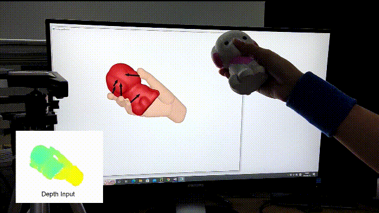

## Content

- <a href="#introduction">Introduction</a>
- <a href="#setup">Setup</a>
- <a href="#runtime">Runtime</a>
- <a href="#hand calibration">Hand Calibration</a>
- <a href="#bibtex">Bibtex</a>

## Introduction

This is the code repository for papers:

- *Single Depth View Based Real-Time Reconstruction of Hand-Object Interactions* (https://dl.acm.org/doi/abs/10.1145/3451341)
- *Physical Interaction: Reconstructing Hand-object Interactions with Physics* (https://dl.acm.org/doi/10.1145/3550469.3555421)

  

## Setup

### Preparation

- Windows 10
- CUDA 8.0 and CUDA 10.0
- Visual Studio 2015 (Later versions are not compatible with CUDA 8)
- 1~2 CUDA Graphic cards (total VRAM>=20GB and at least one >=12GB) (**NVIDIA Titan Xp * 2** are used in our demo)
- Intel RealSense SR300 Camera
- A wrist band with pure color (Blue is used in out demo)

### Setup Python Code

- install **CUDA 10.0** and corresponding **cudnn**

- install dependencies

    ```
    cd Network/JointLearningNeuralNetwork
    pip install -r requirements.txt
    ```

- download pre-trained network from https://drive.google.com/file/d/1wDdBegEpRqFUs0x_9zV6Rm4-Mk_Yajs3/view?usp=sharing, then extract `Network.zip` under the root directory.

- run`JointLearningNeuralNetwork` (need VRAM>=12GB)

    ```
    cd Network/JointLearningNeuralNetwork
    python inference_server.py --gpu <gpu_id>
    ```

- run`LSTMPose`

    ```
    cd Network/LSTMPose
    python inference_server.py --gpu <gpu_id>
    ```

- **Note**:`JointLearningNeuralNetwork` and `LSTMPose` work as local servers on port **8080** and **8081**, respectively. So make sure that the two port numbers are free before running.

### Setup C++ Code

- download **CMake** with GUI (version **3.9** is recommended) 

- make a new directory under source root of C++ code (**Please do not change the position of this new directory**)

  ```
  cd InteractionReconstruction/InteractionReconstruction
  mkdir build
  ```

- General configurations for CMake
  - `Where is the source code` -> {*path to this project*}/InteractionReconstruction/InteractionReconstruction
  - `Where to build the binaries`-> {*path to this project*}/InteractionReconstruction/InteractionReconstruction/build
  - `Specify the generator for this project`-> Visual Studio 14 2015
  - `Optional platform for generator` -> x64
- Configure third libraries
  - **boost-1.61.0**
    - Official: https://www.boost.org/
    - Download: https://sourceforge.net/projects/boost/files/boost/1.61.0/boost_1_61_0.zip/download
  - **ceres-windows & glog**
    - https://github.com/tbennun/ceres-windows
  - **cuda 8.0**
    - Official: https://developer.nvidia.com/cuda-toolkit
    - Download: https://developer.nvidia.com/cuda-80-ga2-download-archive
  - **curl 7.62.0**
    - Official: https://curl.se/
    - Download: https://github.com/curl/curl/releases
  - **eigen 3.2.9**
    - Official: https://eigen.tuxfamily.org/index.php?title=Main_Page
    - Download: https://gitlab.com/libeigen/eigen/-/releases
  - **flann**
    - https://github.com/flann-lib/flann
  - **glew 2.1.0**
    - Official: https://glew.sourceforge.net/
    - Download: https://sourceforge.net/projects/glew/files/glew/2.1.0/
  - **glm 0.9.8.5**
    - https://github.com/g-truc/glm/releases
  - **jsoncpp 1.7.4**
    - https://github.com/open-source-parsers/jsoncpp/releases
  - **libigl 2.3.0**
    - Official: https://libigl.github.io/
    - Download: https://github.com/libigl/libigl/releases
  - **opencv 2.4.10**
    - Official: https://opencv.org/
    - Download: https://sourceforge.net/projects/opencvlibrary/files/opencv-win/2.4.10/opencv-2.4.10.exe/download
  - **opengp**
    - https://github.com/OpenGP/OpenGP
  - **pcl 1.8.0**
    - Official: https://pointclouds.org/
    - Download: https://github.com/PointCloudLibrary/pcl/releases
  - **qt 5.8**
    - Official: https://www.qt.io/
    - Download: https://download.qt.io/new_archive/qt/5.8/5.8.0/
  - **realsense-sdk 2.43.0**
    - Official: https://www.intelrealsense.com/zh-hans/sdk-2/
    - Download: https://github.com/IntelRealSense/librealsense/releases
- generate Visual Studio project
- open Visual Studio project, select the `Release` and `x64` configuration and  set `entry` as the startup project

## Runtime

### Configuration

- set wrist band color in file`InteractionReconstruction/InteractionReconstruction/build/wristband.txt`, make sure the color is between `hsv_min` and `hsv_max`
- write the configuration file, an example is `InteractionReconstruction/InteractionReconstruction/json_manuscript/IO_Parameters_online.json`
- set the path to the configuration file as the command line argument in `Properties`->`Debugging`->`Command Arguments`

### Running

##### Online

- wear the wristband and make sure that the wristband is always in the view of the sensor
- run the code and start tracking hand
- press `R` to start object reconstruction
- rotate the object to gradually reconstruct it
- press `T` when you think that the object is fully reconstructed
- close the `InteractionRecon` window when you want to stop tracking
- if you set `store_org_data` to be true in configuration file, then the raw rgbd data will be stored. The frame ids when you press `R` and `T` will be shown later.

##### Offline

- set `benchmark` to be false in configuration file
- set `left_camera_file_mask` to be the file prefix of the image sequence you have stored
- set `recon_frame` and `stop_recon_frame` to be the frame ids when you press `R` and `T`

## Hand Calibration

Building...

## Bibtex

```
@article{10.1145/3451341,
author = {Zhang, Hao and Zhou, Yuxiao and Tian, Yifei and Yong, Jun-Hai and Xu, Feng},
title = {Single Depth View Based Real-Time Reconstruction of Hand-Object Interactions},
year = {2021},
issue_date = {June 2021},
publisher = {Association for Computing Machinery},
address = {New York, NY, USA},
volume = {40},
number = {3},
issn = {0730-0301},
url = {https://doi.org/10.1145/3451341},
doi = {10.1145/3451341},
month = {jul},
articleno = {29},
numpages = {12},
keywords = {hand-object interaction, hand tracking, Single depth camera, object reconstruction}
}
```

	@inproceedings{10.1145/3550469.3555421,
	author = {Hu, Haoyu and Yi, Xinyu and Zhang, Hao and Yong, Jun-Hai and Xu, Feng},
	title = {Physical Interaction: Reconstructing Hand-Object Interactions with Physics},
	year = {2022},
	isbn = {9781450394703},
	publisher = {Association for Computing Machinery},
	address = {New York, NY, USA},
	url = {https://doi.org/10.1145/3550469.3555421},
	doi = {10.1145/3550469.3555421},
	booktitle = {SIGGRAPH Asia 2022 Conference Papers},
	articleno = {43},
	numpages = {9},
	keywords = {single depth camera, physics-based interaction model, hand tracking, hand-object interaction},
	location = {Daegu, Republic of Korea},
	series = {SA '22 Conference Papers}
	}

